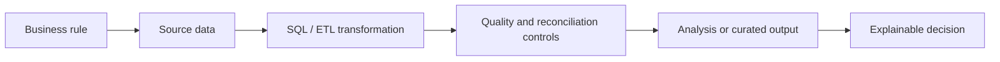

# Hernán Bevilacqua

### Data Analyst · Data Engineering · Controls & Automation

**English** | [Español](#español)

I turn complex operational and billing data into reliable controls, traceable transformations and useful business decisions.

My background combines real-world financial controls with hands-on Azure data engineering projects. In my current role, I am migrating selected ACL controls to Python and Jupyter: extracting authorized Oracle data, reconciling populations with Pandas, applying explainable business rules, and validating both record counts and monetary amounts.

## What I work with

`Python` · `Jupyter` · `Pandas` · `Oracle SQL` · `SQLAlchemy` · `oracledb` · `ACL Analytics` · `Azure Data Factory` · `ADLS Gen2` · `Databricks` · `PySpark` · `Power BI` · `Excel`

## Featured portfolio

| Project | What it demonstrates |
|---|---|
| [Azure End-to-End Data Pipeline](https://github.com/hernano88/azure-end-to-end-data-pipeline) | ADF ingestion, ADLS Gen2, Databricks, PySpark, Spark SQL and Prophet forecasting in one documented flow. |
| [Financial Controls: ACL/Oracle → Python/Jupyter](https://github.com/hernano88/acl-sql-uade) | Professional control pattern evolving from ACL to Python: Oracle extraction, bidirectional Pandas reconciliation, business-rule justifications, line/amount checks and Jupyter reporting. |
| [Databricks + ADLS + PySpark Lab](https://github.com/hernano88/databricks-adls-sql-pyspark-lab) | Hands-on lakehouse workflow: storage access, DataFrame transformations, Spark SQL and processed-data persistence. |
| [MyFigure4ever Business Analytics](https://github.com/hernano88/myfigure4ever) | A real microbusiness translated into landed cost, unit economics, inventory, cohort analysis and auditable Excel controls. |
| [Azure Mapping Data Flow](https://github.com/hernano88/azure-mapping-dataflow-movies) | Visual ETL in Azure Data Factory with cleaning, derived fields and aggregations. |
| [Telco Customer Churn ANN](https://github.com/hernano88/telco-customer-churn-ann) | End-to-end classification workflow using Python and an artificial neural network. |

## How I approach data work

- **Business first:** I clarify what the number means before choosing the tool.
- **Control by design:** totals, exceptions and traceability are part of the solution, not an afterthought.
- **Explainable delivery:** I document assumptions, metric definitions and limitations so the result can be defended in an interview or operational review.
- **Responsible evidence:** public demos use synthetic or rounded data when the production sources contain confidential information.

## Current direction

I am looking for opportunities in **Data Analytics** and **Data Engineering** where I can combine SQL, business understanding, data quality and Azure-based processing. This portfolio is available in English and Spanish because I am prepared to discuss the projects in either language.

---

## Español

### Analista de Datos · Ingeniería de Datos · Controles y Automatización

Transformo datos operativos y de facturación complejos en controles confiables, transformaciones trazables y decisiones útiles para el negocio.

Mi experiencia combina controles financieros reales con proyectos prácticos de ingeniería de datos en Azure. En mi trabajo actual estoy migrando controles seleccionados de ACL a Python y Jupyter: extraigo datos autorizados desde Oracle, concilio universos con Pandas, aplico reglas de negocio explicables y valido tanto cantidades de registros como importes.

### Mi forma de trabajar

- Primero entiendo la regla de negocio y la definición exacta de cada métrica.
- Incorporo conciliaciones, excepciones y trazabilidad desde el diseño.
- Documento supuestos y limitaciones para que cada resultado sea explicable.
- Utilizo datos sintéticos o métricas redondeadas cuando las fuentes reales son confidenciales.

Busco oportunidades en **Data Analytics** e **Ingeniería de Datos** donde pueda combinar SQL, conocimiento del negocio, calidad de datos y procesamiento en Azure.
